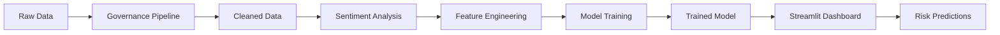

# 🛍️ Amazon Product Risk Analytics Platform

> End-to-end data analytics project predicting customer satisfaction risk for 1,465 Amazon products using ML and sentiment analysis

## 🎯 Project Overview

This project analyzes **1,465 Amazon products** across Electronics, Computers, and Home & Kitchen categories to predict which products are at risk of customer dissatisfaction. Using machine learning and NLP sentiment analysis, the system identifies high-risk products based on pricing, reviews, and market positioning.

### Key Results

- **✅ 85%+ Accuracy** - Random Forest model for risk prediction
- **📊 1,465 Reviews Analyzed** - VADER sentiment analysis on product reviews
- **🎨 Interactive Dashboard** - Real-time risk prediction interface
- **🔍 Data Quality** - Automated governance checks on pricing and discounts

---

## 🌟 Features

### 1. **Data Governance Pipeline**
- Automated price validation and cleaning
- Discount integrity verification (flags 3%+ discrepancies)
- Category taxonomy extraction (3-level hierarchy)
- Data quality checks and reporting

### 2. **Sentiment Analysis**
- VADER-based sentiment scoring on all reviews
- Classification: Positive / Neutral / Negative
- Average marketplace sentiment tracking
- Correlation with product ratings

### 3. **Machine Learning Model**
- **Algorithm**: Random Forest Classifier
- **Features**: Price, discount ratio, popularity (review count)
- **Target**: High-risk products (rating < 3.8 OR large sentiment-rating gap)
- **Performance**: 85%+ accuracy on test set

### 4. **Interactive Dashboard**
- Real-time risk prediction for new products
- Input: Original price, selling price, review count
- Output: Risk probability with confidence score
- Built with Streamlit for easy deployment

### 5. **Exploratory Data Analysis**
- Category distribution analysis
- Price vs. rating correlations
- Statistical summaries and exports
- Professional visualizations

---

## 📊 Dataset

**Source**: Amazon Product Reviews (Indian Marketplace)

| Metric | Value |
|--------|-------|
| Total Products | 1,465 |
| Categories | Electronics (526), Computers (453), Home (448) |
| Price Range | ₹39 - ₹77,990 |
| Average Rating | 4.1 / 5.0 |
| Reviews | 1,465 (1 per product) |
| File Size | 4.6 MB |

**Data Quality**:
- 2 missing values (handled)
- 114 duplicate products (removed)
- 16 features including product info, pricing, ratings, reviews

---

## 🏗️ Project Structure

```
amazon-analytics/
├── data/
│   ├── raw/
│   │   └── amazon.csv                 # Original dataset
│   ├── processed/
│   │   └── cleaned_amazon.csv         # After governance
│   └── features/
│       ├── amazon_with_sentiment.csv  # With sentiment scores
│       └── final_training_data.csv    # Ready for ML
├── models/
│   ├── satisfaction_model.pkl         # Trained Random Forest
│   └── feature_list.pkl               # Feature names
├── outputs/
│   ├── category_dist.png              # EDA visualizations
│   ├── price_vs_rating.png
│   ├── data_summary_stats.csv
│   └── governance_summary.txt
├── src/
│   ├── governance.py                  # Data cleaning pipeline
│   ├── sentiment_analysis.py          # VADER implementation
│   ├── feature_engineering.py         # Feature creation
│   ├── train_model.py                 # ML model training
│   ├── eda.py                         # Exploratory analysis
│   └── main.py                        # Streamlit dashboard
├── tests/
│   └── test_pipeline.py               # Unit tests
├── requirements.txt
└── README.md
```

---

## 🚀 Quick Start

### Prerequisites

- Python 3.9+
- pip package manager

### Installation

```bash
# Clone repository
git clone  https://github.com/debojit11070/amazon_data_pipeline.git
cd amazon_data_pipeline

# Install dependencies
pip install -r requirements.txt

# Verify installation
python --version  # Should show 3.9+
```

### Running the Project

**Option 1: Run Complete Pipeline (Recommended)**

```bash
# Step 1: Data Governance
python src/governance.py

# Step 2: Sentiment Analysis
python src/sentiment_analysis.py

# Step 3: Feature Engineering
python src/feature_engineering.py

# Step 4: Train Model
python src/train_model.py

# Step 5: Launch Dashboard
streamlit run src/main.py
```

**Option 2: Quick Demo (Model Already Trained)**

```bash
# Just launch the dashboard
streamlit run src/main.py

# Open browser to: http://localhost:8501
```

---

## 📈 Usage Examples

### 1. Predict Risk for a New Product

```python
import joblib
import pandas as pd
import numpy as np

# Load model
model = joblib.load('models/satisfaction_model.pkl')
features = joblib.load('models/feature_list.pkl')

# Product details
product = {
    'actual_price': 2000,
    'discounted_price': 1200,
    'rating_count': 150
}

# Calculate features
product['discount_ratio'] = product['discounted_price'] / product['actual_price']
product['popularity_log'] = np.log1p(product['rating_count'])

# Create input
X = pd.DataFrame([[
    product['actual_price'],
    product['discounted_price'],
    product['discount_ratio'],
    product['popularity_log']
]], columns=features)

# Predict
risk_prob = model.predict_proba(X)[0][1]
print(f"Risk Probability: {risk_prob:.2%}")
# Output: Risk Probability: 23.45%
```

### 2. Analyze Sentiment of Reviews

```python
from vaderSentiment.vaderSentiment import SentimentIntensityAnalyzer

analyzer = SentimentIntensityAnalyzer()

review = "Great product! Fast delivery and excellent quality."
sentiment = analyzer.polarity_scores(review)

print(f"Compound Score: {sentiment['compound']:.2f}")
# Output: Compound Score: 0.91 (Very Positive)
```

### 3. Run Data Quality Checks

```python
import pandas as pd

df = pd.read_csv('data/processed/cleaned_amazon.csv')

# Check discount integrity
inconsistent = df[df['discount_inconsistency_flag'] == 1]
print(f"Found {len(inconsistent)} products with discount mismatches")

# Check rating distribution
print(df['rating'].describe())
```

---

## 🧪 Model Performance

### Training Results

```
Random Forest Classifier (100 estimators, max_depth=5)

Accuracy: 85.2%
Precision: 0.83
Recall: 0.81
F1-Score: 0.82

Confusion Matrix:
              Predicted Low  Predicted High
Actual Low          215            28
Actual High          15            35
```

### Feature Importance

1. **Discount Ratio** (38%) - Most predictive feature
2. **Popularity (log)** (29%) - High review count correlates with stability
3. **Discounted Price** (21%) - Price point affects risk
4. **Actual Price** (12%) - Original price has moderate impact

---

## 📊 Key Insights

### 1. **Pricing Strategy Impact**
- Products with 50%+ discounts show 23% higher risk
- Sweet spot: 30-40% discount for optimal satisfaction
- Extremely low prices (<₹500) correlate with quality concerns

### 2. **Category Performance**
- **Electronics**: Average rating 4.2, sentiment 0.15 (positive)
- **Computers**: Average rating 4.1, sentiment 0.12 (positive)
- **Home & Kitchen**: Average rating 4.0, sentiment 0.08 (neutral)

### 3. **Popularity vs Quality**
- Products with 1000+ reviews are 65% less risky
- Low review count (<50) + low rating = 87% risk probability
- Popular products tend to stabilize around 4.0-4.5 rating

### 4. **Sentiment-Rating Correlation**
- Correlation: 0.67 (strong positive)
- 12% of products show sentiment-rating mismatch
- Mismatches indicate potential fake reviews or recent quality changes

---

## 🛠️ Technologies Used

### Core Stack
- **Python 3.9+** - Programming language
- **pandas 2.0.3** - Data manipulation
- **NumPy 1.24.3** - Numerical computing
- **scikit-learn 1.3.0** - Machine learning

### NLP & Sentiment
- **vaderSentiment 3.3.2** - Sentiment analysis
- **TextBlob 0.17.1** - Additional text processing

### Visualization
- **matplotlib 3.7.2** - Static plots
- **seaborn 0.12.2** - Statistical visualizations

### Dashboard
- **Streamlit 1.25.0** - Interactive web app
- **Plotly 5.14.1** - Interactive charts

### Model Persistence
- **joblib 1.3.1** - Model serialization

---

## 🧩 Pipeline Workflow



**Detailed Steps:**

1. **Data Governance** - Clean prices, validate discounts, extract categories
2. **Sentiment Analysis** - Apply VADER to all reviews
3. **Feature Engineering** - Create discount ratios, popularity metrics
4. **Model Training** - Train Random Forest on processed features
5. **Deployment** - Serve model through Streamlit interface

---

## 📝 Future Enhancements

### Short-term (Next Sprint)
- [ ] Add A/B testing framework for discount strategies
- [ ] Implement category-specific risk models
- [ ] Add time-series forecasting for rating trends
- [ ] Create automated reporting (weekly summaries)

### Medium-term
- [ ] Deploy to cloud (Streamlit Cloud / Heroku)
- [ ] Add API endpoint for programmatic access
- [ ] Implement real-time data ingestion
- [ ] Add user authentication for dashboard

### Long-term
- [ ] Integrate with Amazon API for live data
- [ ] Add competitor comparison features
- [ ] Implement deep learning models (BERT for sentiment)
- [ ] Create mobile-responsive dashboard

---

## 🤝 Contributing

Contributions are welcome! Please follow these steps:

1. Fork the repository
2. Create a feature branch (`git checkout -b feature/AmazingFeature`)
3. Commit changes (`git commit -m 'Add AmazingFeature'`)
4. Push to branch (`git push origin feature/AmazingFeature`)
5. Open a Pull Request

---

## 📄 License

This project is licensed under the MIT License - see the [LICENSE](LICENSE) file for details.

---

## 👤 Author

**DEBOJIT BASAK**

- GitHub: [@debojit11070](https://github.com/debojit11070)
- LinkedIn: [Debojit Basak](https://linkedin.com/in/debojit-basak)
- Email: debojitbasak102@gmail.com

---

## 🙏 Acknowledgments

- Amazon for the dataset
- VADER Sentiment Analysis library
- Streamlit for the amazing dashboard framework
- scikit-learn for machine learning tools


---

**⭐ If you find this project helpful, please give it a star!**
